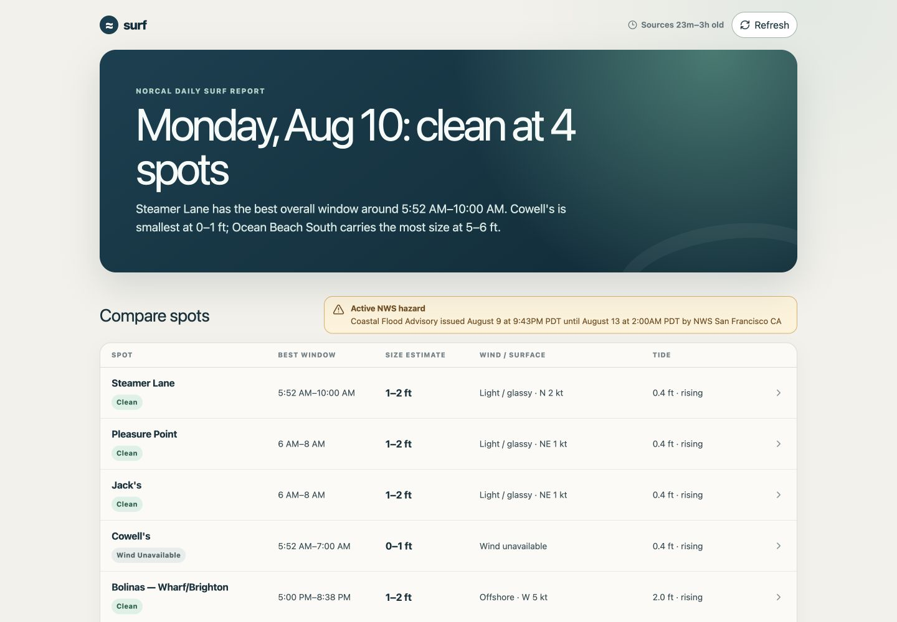

# surf

A self-hosted daily surf report built from public NOAA and CDIP data.

[](https://github.com/aylee/surf/actions/workflows/ci.yml)
[](LICENSE)

`surf` answers the practical question: **where and when should I paddle out?**
It combines nearshore wave guidance, buoy observations, wind, tide, hazards,
and source freshness into a quiet regional outlook with a deeper forecast for
each break.

[View the live NorCal instance](https://surf.alexlee.ai)



## What you get

- A daily comparison of 11 San Francisco, San Mateo, Marin, and Santa Cruz surf spots.
- Five complete local dates of forecast windows, with daylight planning rows,
  estimated size, and clean/fair/choppy surface calls.
- Spot detail for swell, wind, tide, buoy observations, hazards, confidence,
  and source provenance.
- A phone-first Table/Graph workbench with optional, cloud-validated Analysis
  prose generated by a self-hosted oMLX model.
- Hourly ingestion on Cloudflare Workers using D1, R2, and Queues.
- Deterministic forecast facts: no LLM computes wave height, condition, or
  score.

The included catalog is a **NorCal reference configuration**, not a universal
spot database. It currently covers Ocean Beach North/Central/South, Linda Mar,
Stinson, Bolinas Wharf/Brighton, Rodeo Beach, Steamer Lane, Pleasure Point,
Cowell's, and Jack's (38th Avenue).

## Run it locally

Prerequisites: Node.js 24 and pnpm 11 through Corepack.

```bash
git clone https://github.com/aylee/surf.git
cd surf
corepack enable
pnpm install --frozen-lockfile
pnpm dev
```

`pnpm dev` builds the app, applies local migrations, seeds the reference
catalog, and starts the full UI/API at `http://127.0.0.1:8787`. In a second
terminal, fetch the current public forecast data:

```bash
pnpm ingest:local
```

Local ingestion calls live NOAA/CDIP endpoints and can take a moment. No paid
data key or Cloudflare account is required for local development.

Analysis is optional and disabled by default. When enabled, the Worker snapshots
code-owned facts into D1, sends a generic job to a dedicated Cloudflare Queue,
and accepts a report only after the local oMLX runner posts it back through the
authenticated validation endpoint. The model supplies concise connective prose;
code supplies every time, measurement, condition, recommendation, confidence
band, and uncertainty statement. Until an exact-fact report is validated, the
UI says `Analysis is being prepared` or `Analysis unavailable`—it does not
invent a local fallback report. See the
[local narrative runner guide](docs/narrative-runner.md).

## Deploy your own

A Cloudflare account is required for Workers, D1, R2, and Queues. The
checked-in configuration contains no maintainer resource IDs; a fork provisions
and binds resources in its own account.

Follow the [self-hosting guide](docs/self-hosting.md) for authentication,
provisioning, migrations, secrets, first ingest, and deployment verification.
Instance owners should then use the single
[component-aware production release workflow](docs/production-releases.md)
instead of invoking Wrangler directly.

## How forecasts work

Public forecast and observation feeds are normalized into deterministic
forecast windows. A mapped CDIP MOP nearshore forecast is preferred where one
has been verified; NWS coastal-grid wave guidance is the explicit lower-
confidence fallback. Surface condition comes from wind speed and direction
relative to each break. Tide and swell organization add context without
redefining whether the surface is clean.

See [architecture](docs/architecture.md), [data sources](docs/feed-adapters.md),
and the candid [accuracy evaluation](docs/accuracy-evaluation.md) for the full
method and evidence.

## Limits

- Forecast height is an estimate, not a breaking-wave measurement or safety
  guarantee.
- The nearshore backtest is promising but still small; actual-break labels are
  required before any spot is called calibrated.
- Bolinas has no verified direct CDIP MOP point and remains a low-confidence
  NWS fallback.
- Cowell's and Jack's transparently reuse nearby named CDIP/NWS approach
  inputs as uncalibrated proxies. Shared Santa Cruz tide and regional buoy
  inputs do not claim break-level precision.
- This is for surf planning, not navigation, emergency response, or maritime
  safety.

## Develop

The full contributor gate also requires Python 3.12 and
[uv](https://docs.astral.sh/uv/) for the scientific extractor tests.

```bash
pnpm verify
```

The root verification gate exercises an isolated fresh D1, checks generated
files and types, runs every TypeScript/Python test, builds the app, and performs
a secretless deploy dry-run. See
[CONTRIBUTING.md](CONTRIBUTING.md) for change-specific checks and
[docs/README.md](docs/README.md) for the documentation map.

## Repository map

```text
apps/web/                 Cloudflare Worker, Hono API, and React UI
apps/narrative-runner/    Domain-neutral Cloudflare Queue to local oMLX runner
packages/contracts/       Runtime schemas and shared TypeScript types
packages/narrative-contracts/ Versioned narrative transport schemas
packages/forecast-core/   Spot catalog, transforms, surface logic, and scoring
packages/db/              D1 schema, migrations, generated seed, and checks
services/extractor/       Python GRIB2/netCDF/CDIP evaluation and extraction
docs/                     Architecture, data, accuracy, self-hosting, operations
```

MIT licensed. Public feeds retain their respective NOAA, NWS, NDBC, CO-OPS,
and CDIP attribution.
