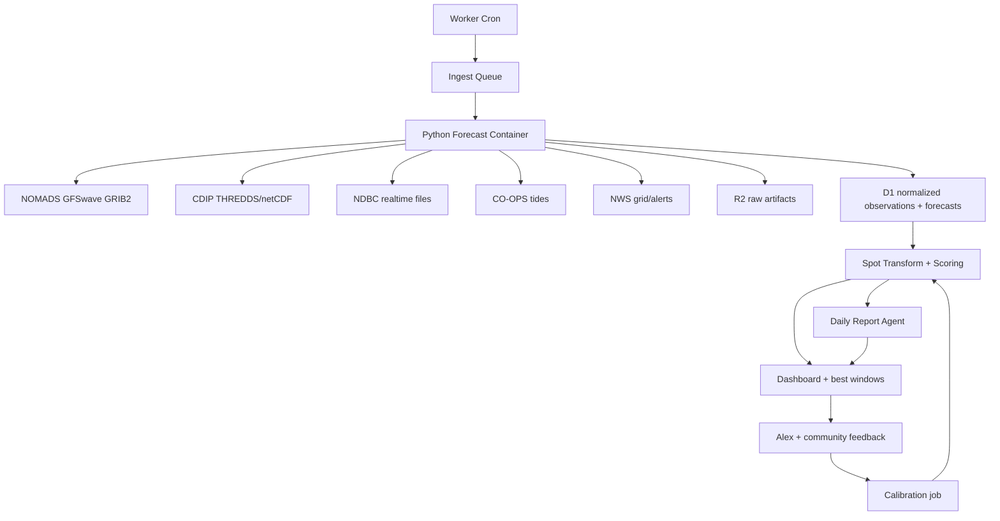

# RFC: Personal NOAA Surf Forecast Engine

**Author:** Alex Lee
**Status:** `DRAFT`
**Reviewers:** None - sole-user side project
**Resources:** [Research](RESEARCH.md)

---

## Problem Statement

Alex wants a true personal surf forecast that can replace Surfline-style SaaS without replacing one subscription with another paid marine API.

**This RFC answers:** what should we build if Codex engineering effort is cheap, recurring API spend is not, and the target is Surfline-level forecast usefulness for a handful of personal spots, with a path to becoming a serious OSS self-hosted surf forecast project?

The core tension is that NOAA/CDIP data is cheap and rich, but not product-shaped. It arrives as GRIB2, netCDF, text buoy files, tide APIs, forecast grids, model cycles, and station metadata. Surfline's value is the translation layer: offshore wave model + nearshore transformation + tide/wind rules + spot knowledge + presentation.

**Tradeoff:** accept more engineering/data-pipeline complexity in exchange for near-zero recurring data cost and real forecast ownership.

**Why this matters:**

- A JSON marine API would get a dashboard faster, but it misses the "own the forecast" goal.
- An LLM agent would make nice prose, but it should not be trusted to compute the forecast.
- A custom ML model is premature until we have labeled spot history.
- NOAA/CDIP already run the hard physics; the product opportunity is extraction, downscaling, calibration, and UX.

## Proposal: Direct Public-Data Forecast Engine

**Core principle:** Use NOAA/CDIP physics-model output as the forecast substrate, then build a deterministic spot-calibration layer that improves with Alex's feedback.

### Architecture

| Layer | Proposed Choice | Why |
|---|---|---|
| Frontend/API | Cloudflare Workers + TypeScript | Fits preferred stack; cheap; easy auth/API/UI deployment |
| UI framework | TanStack Start on Workers, or Vite React + Hono for tiny v0 | TanStack Start is default for net-new TS; Hono+SPA is lower ceremony |
| Auth | Cloudflare Access | Sole-user/operator-only tool |
| Data API | Hono/Worker routes | Typed, simple, Cloudflare-native |
| Forecast database | D1 + Drizzle | Small normalized time-series/read model |
| Raw artifacts | R2 | GRIB2/netCDF subsets, source snapshots, debug artifacts |
| Cache/config | KV | Source freshness, station metadata, cacheable config |
| Scheduling | Worker Cron + Queues | Trigger ingest and fan out source/spot work |
| Heavy processing | Cloudflare Container | Python, wgrib2, ecCodes, xarray, netCDF need Linux/container runtime |
| Feed system | Adapter registry with declared capabilities | OSS users can compose regional data stacks |
| Core forecast logic | Deterministic TypeScript/Python modules | Reproducible, testable, source-auditable |
| LLM/Pydantic AI | Daily reports, explanations, ops diagnostics | Human-style surf reports, not numeric forecast generation |

### Forecast Engine Shape



## What Changes

The prior RFC treated direct NOAA GRIB2 ingestion as a later hardening path. This revision makes it the default.

Open-Meteo moves to optional comparison/evaluation. Stormglass is excluded unless a future decision explicitly accepts paid API spend.

### Feed Layers

Do not pick one feed. The system composes feeds by role.

| Layer | Source | Role | Format | Runtime | Default |
|---|---|---|---|---|---|
| Offshore wave forecast | NOAA/NCEP GFSwave | Forecast swell/wind-wave energy | GRIB2 via NOMADS | Python container | Mandatory |
| Nearshore transform | CDIP modeled data / MOP | California virtual buoys / alongshore transformation | THREDDS/netCDF | Python container | Mandatory where available |
| Observed wave truth | NDBC + CDIP observations | Nowcast, validation, bias correction | Text, spectral files, netCDF | Worker/Python | Mandatory |
| Tides/water level | NOAA CO-OPS | Tide predictions, water levels, currents | JSON API | Worker | Mandatory |
| Wind/weather/hazards | NWS API, later model winds | Wind quality, advisories, context | JSON now, GRIB later | Worker/Python | Mandatory |
| Bathymetry | NOAA ETOPO / regional DEMs | SWAN/custom nearshore fallback | netCDF/GeoTIFF | Python | Optional |
| Forecast comparison | Open-Meteo/manual comparisons | Evaluation oracle | JSON/manual | Worker | Optional |
| Human labels | Alex/community/camera labels | Surf-quality calibration | JSON records | Worker | Optional but important |

### What We Build

1. **Spot registry**: hand-authored profiles for 3-5 initial spots.
2. **Feed adapter registry**: provider coverage, capabilities, formats, retention, attribution, test fixtures.
3. **Model run tracker**: latest source cycles, freshness, errors, raw artifact keys.
4. **GRIB2 extractor**: downloads/subsets GFSwave, extracts point or small-grid timeseries.
5. **CDIP extractor**: maps California spots to alongshore/model points and observed buoys.
6. **Tide/wind/hazard fetchers**: CO-OPS and NWS.
7. **Nearshore transform**: CDIP/MOP where available; empirical transfer table otherwise.
8. **Physical backtester**: calibrates forecasts against historical observations.
9. **Spot quality scorer**: deterministic scoring with confidence and explanation.
10. **Feedback/calibration loop**: captures actual surf ratings and tunes per-spot rules.
11. **Daily report agent**: produces OpenSnow-style narrative from structured forecast facts.

### What We Do Not Build First

- No custom global wave model.
- No neural net surf model.
- No LLM-generated numeric forecast.
- No paid marine API dependency.
- No live camera network.
- No global surf spot database.
- No safety/navigation product.

## Data Model

Use D1 for normalized operational rows, R2 for raw artifacts.

```sql
spots (
  id text primary key,
  name text not null,
  lat real not null,
  lon real not null,
  timezone text not null,
  shore_normal_deg integer,
  config_json text not null,
  active integer not null default 1
);

spot_source_map (
  spot_id text not null,
  source_id text not null,
  role text not null,
  distance_km real,
  weight real,
  metadata_json text,
  primary key (spot_id, source_id, role)
);

sources (
  id text primary key,
  type text not null,
  provider text not null,
  url text,
  license_note text,
  refresh_minutes integer not null
);

source_runs (
  id text primary key,
  source_id text not null,
  cycle_at text,
  forecast_hour integer,
  started_at text not null,
  completed_at text,
  status text not null,
  raw_r2_key text,
  metadata_json text,
  error text
);

wave_observations (
  spot_id text not null,
  source_id text not null,
  observed_at text not null,
  wave_height_m real,
  peak_period_s real,
  mean_period_s real,
  primary_direction_deg integer,
  wind_wave_height_m real,
  swell_height_m real,
  water_temp_c real,
  payload_json text,
  primary key (spot_id, source_id, observed_at)
);

wave_forecasts (
  spot_id text not null,
  source_id text not null,
  model_cycle_at text not null,
  forecast_at text not null,
  lead_hour integer not null,
  offshore_height_m real,
  nearshore_height_m real,
  peak_period_s real,
  primary_direction_deg integer,
  wind_wave_height_m real,
  swell_height_m real,
  swell_period_s real,
  swell_direction_deg integer,
  payload_json text,
  primary key (spot_id, source_id, model_cycle_at, forecast_at)
);

tide_forecasts (
  spot_id text not null,
  station_id text not null,
  forecast_at text not null,
  tide_ft_mllw real not null,
  tide_trend text,
  primary key (spot_id, station_id, forecast_at)
);

wind_forecasts (
  spot_id text not null,
  source_id text not null,
  forecast_at text not null,
  wind_speed_ms real,
  wind_direction_deg integer,
  gust_ms real,
  primary key (spot_id, source_id, forecast_at)
);

spot_scores (
  spot_id text not null,
  forecast_at text not null,
  quality_label text not null,
  score integer not null,
  confidence integer not null,
  wave_score integer not null,
  wind_score integer not null,
  tide_score integer not null,
  source_score integer not null,
  explanation text not null,
  computed_at text not null,
  primary key (spot_id, forecast_at)
);

session_feedback (
  id text primary key,
  spot_id text not null,
  forecast_at text,
  occurred_at text not null,
  rating integer,
  notes text,
  conditions_json text
);

forecast_reports (
  id text primary key,
  region_id text,
  issued_at text not null,
  valid_start_at text not null,
  valid_end_at text not null,
  model_summary_json text not null,
  report_markdown text not null,
  generated_by text not null
);
```

## Processing Plan

### Phase 0: Spot and Source Mapping

Pick 3-5 initial spots and map:

- coordinates;
- shore normal / beach orientation;
- nearest CO-OPS tide station;
- NDBC/CDIP buoys;
- CDIP modeled/alongshore point if available;
- best/acceptable swell directions;
- first-pass tide and wind preferences.

This phase is manual because spot quality is local knowledge. Codex can help find stations and generate profiles, but Alex needs to confirm the actual breaks.

### Phase 1: Feed Adapter Registry

Every feed adapter ships with:

- typed output contract;
- sample fixture files;
- parser tests;
- source metadata and attribution;
- capability declaration;
- geographic coverage rules.

This is what makes the project self-hostable outside Alex's region.

### Phase 2: NOAA/CDIP Data Extractor

Build a Python container with:

- `wgrib2`;
- Python 3.12+;
- `xarray`;
- `cfgrib`;
- `eccodes`;
- `netCDF4`;
- `pydantic`;
- `httpx`.

Jobs:

- discover latest complete GFSwave cycle;
- call NOMADS GFS Wave filter for target region/fields/hours;
- write GRIB2 subsets to R2;
- extract model time series for reference points;
- load CDIP netCDF modeled/observed data;
- write normalized rows to D1.

The first extraction can use nearest-gridpoint values. Bilinear interpolation and spectral partition handling can come after the pipe is working.

### Phase 3: Tide, Wind, and Alerts

Worker-native fetchers:

- CO-OPS tide predictions and observations;
- NWS `/points/{lat},{lon}` mapping;
- NWS grid forecast wind fields and alerts.

These are JSON and do not require the Python container.

### Phase 4: Physical Backtesting

Before relying on human anecdotes, backtest physical forecast accuracy:

- GFSwave forecast vs NDBC/CDIP observations;
- CDIP modeled nearshore vs observed buoys where possible;
- CO-OPS predictions vs observed water level;
- wind forecast vs available station observations.

This produces bias correction and confidence scoring without requiring Alex labels.

### Phase 5: Spot Forecast and Scoring

Compute:

- best windows for next 7 days;
- hourly surf quality labels;
- confidence;
- source freshness;
- factor explanations.

Initial scoring is deterministic:

```ts
quality = weightedMean({
  wave: waveFit(height, period, direction, spot),
  tide: tideFit(tideLevel, tideTrend, spot),
  wind: windFit(windSpeed, windDirection, spot),
  source: sourceConfidence(modelAge, buoyAgreement, missingFields),
});
```

### Phase 6: Surf-Quality Calibration

Every time Alex or an OSS user surfs/checks/skips:

- record actual quality rating;
- snapshot forecast inputs;
- compare predicted score vs actual rating;
- update spot profile or learned coefficients.

Start with simple calibration:

- per-spot height multipliers;
- direction/period transfer table;
- tide window adjustments;
- wind penalty tuning.

Only move to gradient boosting or similar once there are enough labeled examples.

For OSS:

- labels stay local by default;
- users can opt into anonymized contribution;
- shared labels should include source snapshots so calibration can be reproduced.

### Phase 7: Daily Surf Report Agent

Generate a daily regional report from structured forecast rows:

- best windows;
- what changed since yesterday;
- swell source/timing;
- wind/tide caveats;
- confidence and model disagreement;
- what could bust.

The agent can write like a human forecaster, but it must cite source runs and cannot invent numeric values.

### Phase 8: Optional Nearshore Physics Expansion

If CDIP coverage is insufficient or the empirical transfer table underperforms:

- evaluate SWAN for a single region/spot;
- use NOAA ETOPO or better regional bathymetry;
- force SWAN with GFSwave boundary spectra and wind;
- compare output against CDIP/NDBC/actual ratings.

This is not v0. It is the fallback for regions where CDIP-like nearshore outputs do not exist.

## Role of ML and LLMs

### Not First: ML

Do not train an ML model first. We do not have labels. The hard physics is already handled by NOAA/CDIP. Early ML would be noisy and harder to debug than a transparent scoring function.

ML becomes useful when:

- we have months of Alex ratings;
- the deterministic rules consistently miss specific patterns;
- we can evaluate against held-out sessions.

Use simple models first: regression, calibrated classifiers, gradient boosted trees. A neural net is unlikely to be justified for a one-user, few-spot app.

### Report Layer: LLM/Pydantic AI

Do not let an LLM forecast surf conditions.

Acceptable uses:

- natural-language morning brief from structured rows;
- "why is today rated good?" explanation;
- Brian Allegretto/OpenSnow-style narrative surf report;
- data quality triage;
- source failure summaries;
- suggesting calibration changes for review.

Pydantic is still useful for typed contracts. Pydantic AI is optional for interpretation and ops, not for generating numbers.

## Cost Expectations

The target cost is Cloudflare-only:

- Workers Paid plan if Containers are used.
- Container usage should be low because extraction runs on a schedule and scales to zero.
- R2 stores raw GRIB/netCDF subsets; D1 stores compact normalized rows.
- NOAA/CDIP/NDBC/CO-OPS/NWS data is free public data with attribution/use constraints.

Expected paid triggers:

| Trigger | Cost Impact |
|---|---|
| Cloudflare Containers | Workers Paid plan and usage beyond included vCPU/memory/disk |
| Larger raw archive | R2 storage/operation usage |
| More frequent model cycles or many spots | More container runtime and D1 writes |
| Paid marine API comparison source | Explicit future decision, not default |

## Why This Approach

**Pros:**

- Best alignment with the real goal: Surfline-like forecast ownership at low recurring cost.
- Uses public physics model output instead of trying to recreate wave science.
- Keeps paid API dependency out of the core path.
- Gives full provenance: every score traces back to source run, station, model cycle, and scoring rule.
- Can become a meaningful OSS project because feeds, spots, and labels are modular.
- Supports a daily report surface that feels like a human forecast without letting the agent invent physics.
- Lets Codex spend effort where it matters: data processing, calibration, UX, tests.

**Cons / Risks:**

- More engineering than JSON APIs.
- GRIB2/netCDF tooling requires a container or non-Worker runtime.
- CDIP advantage may be California-specific.
- Spot scoring will be mediocre until calibrated.
- Cloudflare Containers are a newer platform surface and need empirical cost/runtime testing.
- OSS contribution pipelines need privacy, anti-spam, and licensing guardrails.

## Safeguards

- **S-1:** Numeric forecasts come only from deterministic code over structured source data.
- **S-2:** LLM output may summarize or explain, but may not invent or modify wave/tide/wind values.
- **S-3:** Every forecast row stores source ID, model cycle, forecast hour, and extraction timestamp.
- **S-4:** The dashboard shows source freshness and confidence separately from surf quality.
- **S-5:** Missing/stale data degrades to `unknown`, not a fabricated score.
- **S-6:** No paid forecast API becomes required without an explicit decision.
- **S-7:** Spot scoring rules remain visible in code/config and covered by fixture tests.
- **S-8:** Community labels are opt-in, reproducible, and never required for a private self-hosted instance.
- **S-9:** Daily reports cite structured forecast facts and source runs.

## Alternatives Considered

### Open-Meteo Marine First

Fast JSON feed using public/open model sources behind the scenes.

**Why not default:** It solves product plumbing, not forecast ownership. Keep as a comparison feed, not the core engine.

### Stormglass First

Paid marine API with convenient surf-relevant fields.

**Why rejected:** It recreates the SaaS-fee problem.

### Train ML Model Now

Train a model to predict surf quality.

**Why rejected:** No labels yet, and NOAA/CDIP already solve the wave-physics layer. Start with deterministic scoring and gather feedback.

### LLM Forecast Agent

Use Pydantic AI to reason over raw data and produce the forecast.

**Why rejected:** Non-deterministic and wrong abstraction. LLMs can explain forecasts, not compute them.

### LLM Daily Report Agent

Use Pydantic AI to write a regional narrative forecast after deterministic scoring is complete.

**Why accepted:** This is the right use of agents. The agent turns structured facts into a report, calls out uncertainty, and explains source disagreement. It does not create the numeric forecast.

### Run SWAN From Day One

Build custom nearshore wave model per region.

**Why not first:** It may be right later, but CDIP/MOP and empirical transfer functions are a cheaper first path for personal spots.

## Open Questions

- [ ] What are the first 3-5 surf spots?
- [ ] Are those spots in California, where CDIP/MOP can be the nearshore backbone?
- [ ] Is Cloudflare Containers acceptable as part of the Cloudflare bill?
- [ ] How much raw GRIB/netCDF history should we retain in R2?
- [ ] What feedback ritual will Alex actually use: post-session rating, morning check, or both?
- [ ] Should the OSS project include an optional shared calibration corpus from day one?
