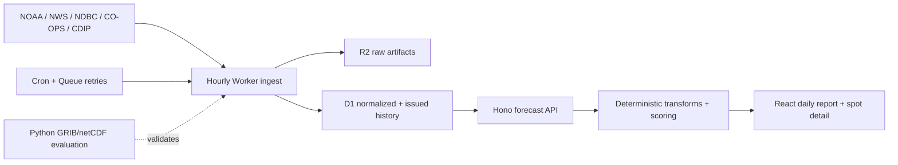

# Architecture

`surf` is a Cloudflare application with a small Python scientific companion.
The runtime favors traceable public inputs and deterministic forecast output
over a large service graph.

## Runtime components

| Component | Responsibility |
|---|---|
| `apps/web/worker` | Fetch public feeds, preserve provenance, normalize rows, retain history, and serve the API |
| `apps/web/src` | Render the daily regional outlook and per-spot forecast without owning forecast physics |
| `packages/contracts` | Validate API and forecast data at package boundaries |
| `packages/forecast-core` | Own the reference spot catalog, wave transforms, surface classification, and scoring |
| `packages/db` | Own the SQL migration history, generated reference seed, and migration checks |
| `services/extractor` | Decode/evaluate GRIB2 and netCDF data that is too heavy or specialized for a Worker |

## Data ownership

- **R2** stores checksum-addressed raw provider responses and future large model
  subsets. Raw artifacts are evidence, not the operational read model.
- **D1** stores normalized forecast/observation rows, source runs, immutable
  issued history, and the spot/source reference seed.
- **Queues** isolate scheduled ingestion from the cron trigger and provide
  retries/dead-letter handling.

Bindings are the only runtime path to these Cloudflare resources. Account IDs,
database IDs, namespace IDs, and secrets are instance state and do not belong
in Git.

## Forecast ownership

The system keeps four concepts separate:

1. **Source facts** — provider values, timestamps, units, station/model point,
   and raw payload evidence.
2. **Physical derivation** — deterministic unit conversion and explicit
   nearshore/exposure transforms.
3. **Surface classification** — wind direction and speed relative to the
   configured break geometry.
4. **Planning context** — tide, swell organization, hazards, freshness, and
   confidence.

Mapped CDIP MOP point forecasts are preferred for nearshore height. NWS MTR
coastal-grid waves are the lower-confidence fallback. A clean/fair/choppy call
describes the surface; it is not an overall vendor-style surf rating. Every
forecast window retains source run IDs and caveats so missing or stale data
cannot be silently converted into certainty.

LLMs do not own any numeric step. If an explanation layer is added later, it
must consume already-structured facts and may not invent or repair them.

## Configuration boundary

The checked-in catalog is a versioned NorCal reference configuration. Spot
geometry, source mapping, and deterministic priors are code-reviewed forecast
inputs—not per-user preferences. The D1 reference seed is generated from the
catalog so runtime and stored configuration cannot drift independently.

Adding a region requires more than coordinates: verified provider coverage,
break-specific wind geometry, tide and buoy mappings, source attribution,
fixtures, and an honest confidence posture all travel together.

## Request and ingest flow

1. The hourly cron enqueues one regional ingest request.
2. The Queue consumer fetches each bounded public source through its adapter.
3. Raw captures and hashes are written to R2; source-run metadata and
   normalized rows are written to D1.
4. Issued forecast history is sampled on the documented cadence and old rows
   are pruned according to the retention policy.
5. API requests join the best available wave, wind, tide, hazard, and
   observation rows into daylight forecast windows.
6. `forecast-core` applies deterministic surface/scoring rules and the UI
   exposes the result, source freshness, and caveats.

See [feed adapters](feed-adapters.md) for provider details and
[runtime operations](runtime-operations.md) for failure and recovery behavior.
