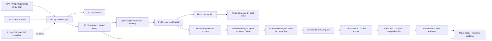

# Architecture

`surf` is a Cloudflare application with a small Python scientific companion.
The runtime favors traceable public inputs and deterministic forecast output
over a large service graph.

```mermaid
flowchart LR
  feeds["NOAA / NWS / NDBC / CO-OPS / CDIP"] --> ingest["Hourly Worker ingest"]
  ingest --> raw["R2 raw artifacts"]
  ingest --> rows["D1 normalized + issued history"]
  queue["Cron + Queue retries"] --> ingest
  rows --> core["Deterministic transforms + scoring"]
  core --> readmodels["D1 forecast read models"]
  readmodels --> api["Hono forecast API"]
  api --> ui["React daily report + spot detail"]
  readmodels --> facts["Allowlisted public fact bundles"]
  facts --> signal["Versioned Analysis signal via ingest Queue"]
  signal --> ledger["D1 narrative ledger + exact fact snapshot"]
  ledger --> narrativeq["Dedicated narrative Queue"]
  narrativeq --> runner["Out-of-band HTTP pull runner"]
  runner --> model["Local oMLX · OpenAI-compatible API"]
  model --> result["Authenticated result endpoint"]
  result --> validate["Cloud policy + rendering validators"]
  validate --> rows
  python["Python GRIB/netCDF evaluation"] -. validates .-> ingest
```

## Runtime components

| Component | Responsibility |
|---|---|
| `apps/web/worker` | Fetch public feeds, preserve provenance, normalize rows, retain history, and serve the API |
| `apps/web/src` | Render the daily regional outlook and per-spot forecast without owning forecast physics |
| `packages/contracts` | Validate API and forecast data at package boundaries |
| `packages/forecast-core` | Own the reference spot catalog, wave transforms, surface classification, and scoring |
| `packages/db` | Own the SQL migration history, generated reference seed, and migration checks |
| Narrative control plane | Snapshot code-owned facts, persist a D1 job ledger, produce domain-neutral Queue jobs, reconcile ambiguous sends, and publish exact-fact revisions |
| `apps/narrative-runner` | Pull Queue work over HTTPS, call a configurable local oMLX model, post generated or terminal results, and settle messages with bounded leases |
| Surf Analysis validator | Derive provenance from used code-owned slots, reject changed recommendations or unsupported claims, render the report, and expose published/pending/unavailable lifecycle states |
| `services/extractor` | Decode/evaluate GRIB2 and netCDF data that is too heavy or specialized for a Worker |

## Data ownership

- **R2** stores checksum-addressed raw provider responses and future large model
  subsets. Raw artifacts are evidence, not the operational read model.
- **D1** stores normalized forecast/observation rows, source runs, immutable
  issued history, the spot/source reference seed, the latest validated
  1-hour/3-hour API read models, per-date fact bundles, and the narrative
  job/revision ledger.
- **Queues** isolate scheduled ingestion from the cron trigger and provide
  retries/dead-letter handling. Analysis uses a separate producer-only Queue;
  its consumer is an out-of-band HTTP pull runner, not a Worker consumer.

Bindings are the only runtime path to these Cloudflare resources. Account IDs,
database IDs, namespace IDs, and secrets are instance state and do not belong
in Git.

## Narrative control plane

Analysis is a generic asynchronous narrative pipeline rather than a hosted or
interactive agent. After each spot generation publishes, its materialization
invocation sends one versioned, generation-fenced `analysis-signal` message
through the ingest Queue. That separate Queue invocation reloads the current
active local-date bundles instead of trusting facts in the signal. For each
date it builds a stable fingerprint from only output-visible code-owned values,
writes the exact job and validation snapshot to D1, then sends the authoritative
stored envelope to a dedicated Queue. This hop keeps both the forecast
publication invocation and five-date Analysis signaling below D1 Free's
50-query limit. Ledger-first insertion and scheduled reconciliation cover the
non-atomic D1-to-Queue boundary. Stable generation identity deduplicates
redelivery and unchanged facts; a fresh per-attempt submission ID keeps late
callbacks from an older attempt from terminating or publishing a rearm. The
Analysis signal itself is advisory and ACK-only after structured failure
logging, including malformed/version-skewed envelopes recognized at the raw
Queue boundary; hourly ledger reconciliation and the next generation recover it
without consuming the source-ingest Queue's retry budget. The earliest
recommendation-bearing date refreshes hourly; later dates refresh every three
spot-local hours. Exact-fact reads fail closed between those bounded future-day
refreshes rather than serving an older report.

The always-on runner is deliberately outside Cloudflare. It HTTP-pulls only
when local capacity is available, calls an OpenAI-compatible oMLX server, and
posts either generated output or an identifiable terminal outcome to
`/api/internal/narratives/results`. Cloudflare authenticates before reading a
bounded request body, validates the current submission and exact fact
fingerprint, derives provenance from the value slots used, renders the report,
and conditionally publishes it. Queue delivery is at least once, so result and
settlement paths are idempotent.

`ForecastBriefAgent`, its `FORECAST_BRIEF_AGENT` binding, and migration 0002
remain checked in and exported only as dormant rollback compatibility. They are
not signaled by the active ingest path and must not be enabled as the current
Analysis architecture.

## Forecast ownership

The system keeps four concepts separate:

1. **Source facts** — provider values, timestamps, units, station/model point,
   and raw payload evidence.
2. **Physical derivation** — deterministic unit conversion and explicit
   nearshore/exposure transforms.
3. **Surface classification** — wind direction and speed relative to the
   configured break geometry.
4. **Planning context** — tide, swell organization, hazards, freshness, and
   confidence.

Mapped CDIP MOP point forecasts are preferred for nearshore height. NWS MTR
coastal-grid waves are the lower-confidence fallback. A clean/fair/choppy call
describes the surface; it is not an overall vendor-style surf rating. Every
forecast window retains source run IDs and caveats so missing or stale data
cannot be silently converted into certainty.

LLMs do not own any numeric or ranking step. The optional local model writes
only bounded connective templates around assigned value slots. Code owns surf
size, swell evolution, wind/surface state, tide timing, best and backup windows,
confidence band, and the bust factor. The cloud rejects output that changes the
recommendation semantics, authors measurements or ratings, introduces an
unsupported condition/causation claim, emits links/HTML/safety imperatives, or
uses a value outside its assigned paragraph. Provenance is derived by the
cloud from each used slot; the model does not perform fact-reference
bookkeeping.

There is no pseudo-report on failure. `/brief` v3 returns an honest
`published`, `pending`, or `unavailable` response with `Cache-Control:
no-store`; the deterministic Forecast tab remains available independently.
See [local narrative runner](narrative-runner.md) for the operator boundary.

## Configuration boundary

The checked-in catalog is a versioned NorCal reference configuration. Spot
geometry, source mapping, and deterministic priors are code-reviewed forecast
inputs—not per-user preferences. The D1 reference seed is generated from the
catalog so runtime and stored configuration cannot drift independently.

Adding a region requires more than coordinates: verified provider coverage,
break-specific wind geometry, tide and buoy mappings, source attribution,
fixtures, and an honest confidence posture all travel together.

## Request and ingest flow

1. The hourly cron enqueues one regional `source-ingest` request.
2. The Queue consumer turns that root request into the stable checked-in set of
   versioned `source-batch` messages. Each message carries a canonical sorted,
   unique set of at most four spot IDs while preserving the root ingest ID and
   logical generation time; a batch message cannot dispatch more batches.
3. Each source batch attempts all five public adapters with only its configured
   spots and their operational NDBC stations. The current exact worst-case
   external-request counts, including CDIP metadata `HEAD` fallbacks, are
   36/36/25 and are locked below the Free Worker limit by tests. CO-OPS, NWS
   grid wave, and CDIP share the exact next-midnight boundary after the fifth
   complete local date, including the 121-hour fall-back window.
4. After every adapter attempt settles, batch-specific raw captures and hashes
   are written to R2; source-run metadata and only that batch's normalized rows
   are written to D1. Captures are checksum-sorted before deterministic artifact
   IDs and keys are assigned, so concurrent completion order and Queue replay
   cannot remap evidence. Normalized tables, source runs, finalization, and
   artifact metadata use bounded JSON-backed bulk statements rather than a D1
   statement per provider row. Shared NDBC observations never fan outside the
   batch. A real-D1 production-shaped fixture locks this source pipeline at 31
   statements, or 32 for the Queue child including its generation-fence read.
5. Issued forecast history is sampled on the documented cadence and old rows
   are pruned according to the retention policy.
6. After normalized persistence succeeds, each source batch fans out one
   immutable materialization message for only its own spots. Canonical batch
   suffixes make source-run and raw-artifact identities idempotent; stable root
   ingest IDs and an indexed logical-generation watermark make duplicate or
   reordered Queue delivery safe. Superseded jobs exit without publishing.
   Provider degradation remains visible in the terminal log, but once the
   complete usable child set is accepted the batch ACKs and leaves the next
   provider attempt to the next hourly root. This prevents a Queue retry from
   multiplying already-dispatched materialization children.
7. Each spot invocation joins the best available wave, wind, tide, hazard, and
   observation rows, then `forecast-core` applies deterministic surface and
   scoring rules. History capture reuses that spot's assembled 3-hour response.
8. A synchronized 1-hour/3-hour generation and each forecast-date fact bundle
   are validated and atomically published for that spot. Their fingerprint is
   derived from the facts actually assembled, and queued generations retain
   their ingest ID for end-to-end rollout correlation. An all-unknown
   generation never replaces the previous good one, while unrelated spots can
   continue advancing.
9. Forecast GETs perform one indexed D1 lookup and return the pre-serialized
   response. Cacheable successes are also protected by Cloudflare's
   version-scoped Worker cache. After publication, materialization emits one
   versioned Analysis signal through the ingest Queue. Its separate invocation
   reloads every matching active date bundle and creates the narrative ledger
   jobs; request traffic never reruns forecast physics or scoring. Instrumented
   real-D1 fixtures lock the conservative materialization path at 17 statements
   and the five-date signal path at 36, independently below the Free limit.
10. `/brief` compares the current exact fact fingerprint with a validated D1
   revision and returns `published`, `pending`, or `unavailable` without edge
   caching. A report generated for superseded values is never served under the
   stable spot/date URL.
11. The UI exposes the result, source freshness, and caveats, and retains its
   last good response through a retryable read-model refresh failure.

See [feed adapters](feed-adapters.md) for provider details and
[runtime operations](runtime-operations.md) for failure and recovery behavior.
