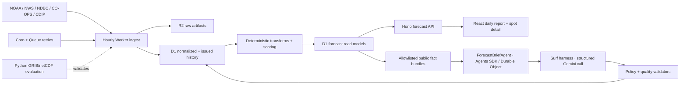

# Architecture

`surf` is a Cloudflare application with a small Python scientific companion.
The runtime favors traceable public inputs and deterministic forecast output
over a large service graph.

```mermaid
flowchart LR
  feeds["NOAA / NWS / NDBC / CO-OPS / CDIP"] --> ingest["Hourly Worker ingest"]
  ingest --> raw["R2 raw artifacts"]
  ingest --> rows["D1 normalized + issued history"]
  queue["Cron + Queue retries"] --> ingest
  rows --> core["Deterministic transforms + scoring"]
  core --> readmodels["D1 forecast read models"]
  readmodels --> api["Hono forecast API"]
  api --> ui["React daily report + spot detail"]
  readmodels --> facts["Allowlisted public fact bundles"]
  facts --> agent["ForecastBriefAgent · Agents SDK / Durable Object"]
  agent --> model["Surf harness · structured Gemini call"]
  model --> validate["Policy + quality validators"]
  validate --> rows
  python["Python GRIB/netCDF evaluation"] -. validates .-> ingest
```

## Runtime components

| Component | Responsibility |
|---|---|
| `apps/web/worker` | Fetch public feeds, preserve provenance, normalize rows, retain history, and serve the API |
| `apps/web/src` | Render the daily regional outlook and per-spot forecast without owning forecast physics |
| `packages/contracts` | Validate API and forecast data at package boundaries |
| `packages/forecast-core` | Own the reference spot catalog, wave transforms, surface classification, and scoring |
| `packages/db` | Own the SQL migration history, generated reference seed, and migration checks |
| `ForecastBriefAgent` | Use the Cloudflare Agents SDK and Durable Object SQLite to coordinate one brief per spot/day, material revisions, and bounded retries |
| Surf forecast harness | Build role-tagged public facts, call Gemini through AI SDK, validate sentence-level evidence, insert locked caveats, and publish accepted prose |
| `services/extractor` | Decode/evaluate GRIB2 and netCDF data that is too heavy or specialized for a Worker |

## Data ownership

- **R2** stores checksum-addressed raw provider responses and future large model
  subsets. Raw artifacts are evidence, not the operational read model.
- **D1** stores normalized forecast/observation rows, source runs, immutable
  issued history, the spot/source reference seed, and the latest validated
  1-hour/3-hour API read models plus per-date brief fact bundles.
- **Queues** isolate scheduled ingestion from the cron trigger and provide
  retries/dead-letter handling.

Bindings are the only runtime path to these Cloudflare resources. Account IDs,
database IDs, namespace IDs, and secrets are instance state and do not belong
in Git.

## What “Agent” means here

Surf uses the open-source Cloudflare Agents SDK inside its existing Worker. A
named `ForecastBriefAgent` is a SQLite-backed Durable Object that deduplicates
spot/date signals, coordinates generation, schedules bounded retries, and
records job state. It is not a hosted agent configured at
`agents.cloudflare.com`.

Surf supplies the agent harness itself. The harness assembles public facts,
invokes Gemini directly through AI SDK's Google provider, validates the result,
and writes accepted revisions to D1. There is no `AIChatAgent`, Think harness,
public Agent route, chat session, WebSocket, MCP server, user-authored prompt,
or model tool loop in this feature. Durable Object SQLite holds coordination
state only; D1 remains the product-visible brief/history store.

## Forecast ownership

The system keeps four concepts separate:

1. **Source facts** — provider values, timestamps, units, station/model point,
   and raw payload evidence.
2. **Physical derivation** — deterministic unit conversion and explicit
   nearshore/exposure transforms.
3. **Surface classification** — wind direction and speed relative to the
   configured break geometry.
4. **Planning context** — tide, swell organization, hazards, freshness, and
   confidence.

Mapped CDIP MOP point forecasts are preferred for nearshore height. NWS MTR
coastal-grid waves are the lower-confidence fallback. A clean/fair/choppy call
describes the surface; it is not an overall vendor-style surf rating. Every
forecast window retains source run IDs and caveats so missing or stale data
cannot be silently converted into certainty.

LLMs do not own any numeric step. The optional daily forecaster receives only
role-tagged public-data facts and deterministic picks. Gemini may write concise
connective prose, but every model-authored sentence carries fact references.
The result is rejected if it changes a recommendation, cites the wrong window,
introduces an unsupported measurement or qualitative claim, weakens modeled
versus observed semantics, emits links/HTML/safety imperatives, or misses the
deterministic usefulness and naturalness floor.

Measurement, proxy, fallback, calibration, hazard, and observation caveats are
locked and inserted by code rather than paraphrased by the model. When model,
policy, quality, or storage work fails, the read endpoint serves the local
fact-based summary and the core forecast remains available. See
[forecast brief evaluation](forecast-brief-evaluation.md) for the secretless
checks, optional live evaluation, and rollout contract.

## Configuration boundary

The checked-in catalog is a versioned NorCal reference configuration. Spot
geometry, source mapping, and deterministic priors are code-reviewed forecast
inputs—not per-user preferences. The D1 reference seed is generated from the
catalog so runtime and stored configuration cannot drift independently.

Adding a region requires more than coordinates: verified provider coverage,
break-specific wind geometry, tide and buoy mappings, source attribution,
fixtures, and an honest confidence posture all travel together.

## Request and ingest flow

1. The hourly cron enqueues one regional ingest request.
2. The Queue consumer fetches each bounded public source through its adapter.
3. Raw captures and hashes are written to R2; source-run metadata and
   normalized rows are written to D1.
4. Issued forecast history is sampled on the documented cadence and old rows
   are pruned according to the retention policy.
5. After normalized persistence succeeds, the source-ingest invocation fans
   out one immutable materialization message per spot. Stable ingest IDs and an
   indexed logical-generation watermark make duplicate or reordered Queue
   delivery safe; superseded children exit without publishing.
6. Each spot invocation joins the best available wave, wind, tide, hazard, and
   observation rows, then `forecast-core` applies deterministic surface and
   scoring rules. History capture reuses that spot's assembled 3-hour response.
7. A synchronized 1-hour/3-hour generation and each forecast-date fact bundle
   are validated and atomically published for that spot. Their fingerprint is
   derived from the facts actually assembled, and queued generations retain
   their ingest ID for end-to-end rollout correlation. An all-unknown
   generation never replaces the previous good one, while unrelated spots can
   continue advancing.
8. Forecast GETs perform one indexed D1 lookup and return the pre-serialized
   response. Cacheable successes are also protected by Cloudflare's
   version-scoped Worker cache. Brief reads and Agent signals use the matching
   stored fact bundle, so request traffic never reruns forecast physics or
   scoring.
9. The UI exposes the result, source freshness, and caveats, and retains its
   last good response through a retryable read-model refresh failure.

See [feed adapters](feed-adapters.md) for provider details and
[runtime operations](runtime-operations.md) for failure and recovery behavior.
